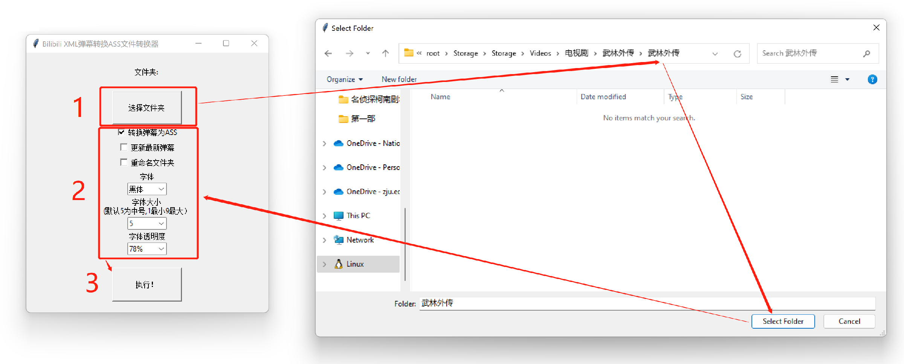

# 可视化Bilibili本地视频XML弹幕转换ASS字幕转换器

一个可视化，打开即用的将B站弹幕转换为本地播放器可识别的ASS格式字幕的工具。

如果由于网络问题导致Github中此文档的图片无法正常加载，请移步以下中国境内的仓库来查看和阅读使用说明（不过还是希望大家多多Star Github仓库）：

<http://cmsci.net/wnb/bilibili-xmlsubtitle-to-ass/tree/master>

另外这个工具还有一个妙用，如果你想看一部曾经在B站上存在过但现在下架了的电视剧/电影的弹幕，用这个工具也能多多少少帮你做到这一点，具体方式请往下看。

## 下载/运行方式

### 直接运行

如果你是程序小白，那么请直接点击下方链接下载此程序（12.5MB）。

-   下载地址1【CMSCI（在中国境内下载速度会比较快）】：<http://cmsci.net/wnb/bilibili-xmlsubtitle-to-ass/blob/master/dist/bilibiliXML2ASS.zip>

-   下载地址2【Github】：<https://raw.githubusercontent.com/NaiboWang/Bilibili-XMLSubtitle-to-ASS/master/dist/bilibiliXML2ASS.zip>

下载完成后解压得到bilibiliXML2ASS.exe，在Win 10/Win 11系统双击打开即可，第一次打开可能需要等待15-20秒。

### Python运行

当然，如果懂Python的朋友，可以直接下载此仓库的bilibiliXML2ASS.py文件，这个文件就小多了。

Python运行方式：

首先安装依赖包：

>   pip install -r requirements.txt

然后运行：

>   python bilibiliXML2ASS.py

如有需要，你还可以根据代码进行修改。

## 实现效果

### 功能介绍

本工具可以把下载好的B站视频的默认XML弹幕文件，转换为本地播放器可以识别的ASS字幕文件并加载播放，以实现**脱离B站播放器，使用本地播放器（如PotPlayer）播放视频并带弹幕的功能**。同时，提供以下额外功能：

1.  弹幕更新功能，根据info文件更新最新的弹幕（慎用，因为B站接口原因，更新后的弹幕条数可能会小于原来的条数，当然，更新后原来的弹幕文件不会被删除，而是改了名字）。

2.  **根据视频大小自动修改对应弹幕字体大小**，即自适应。

3.  支持对**使用B站Windows客户端下载的视频文件夹**进行**重命名。**

4.  自定义弹幕字体样式，大小，透明度, 单条弹幕持续时间。

5. 本仓库还讲了如何下载已下架和不能下载的B站视频的弹幕文件，配合第三方下载同样可以实现本地观看弹幕功能。

### 效果图

【电影：美人鱼】

【名侦探柯南剧场版】

【电视剧：地下交通站】

【游戏录播：仙剑奇侠传四】

工具会自动匹配视频分辨率，以生成对应的字体大小，如：

【高分辨率视频4K：神探狄仁杰】

【低分辨率360P视频：梦比优斯奥特曼】

即不管视频多大（360P也好，4K也好），生成的字幕字体大小都是看上去很合适的，网上的其他工具暂时都没有实现这一点。

弹幕的字体样式，大小和透明度也可以调整，如**楷体大号低透明度**《亮剑》弹幕：

【电视剧：亮剑】

总之，只要是B站的XML弹幕文件（不论视频是从哪里下载的），都可以转换为本地播放器（如PotPlayer）可以加载的弹幕文件，效果与B站官方播放器基本无差（除了高级弹幕和自动防挡功能）。

当然，如果弹幕数量过多会影响观看，毕竟没有自动防挡字幕功能，这时候建议将字幕的透明度降低：

【鬼畜视频：念诗之王】

## 开发原因

一些碎碎念，想看使用方式的请直接跳过这部分直接看[使用方式](#使用方式)。

本来想着找个现成的工具可以直接转换字幕就完了，但是找了好久发现这些工具多多少少都不能满足我的需求，所以就干脆自己改改，代码也写的很乱，写着写着觉得这东西可能对某些朋友有用，所以就发布一下。

### 为什么要将B站视频下载下来？

我本人是喜欢配合弹幕看视频，从而获得双倍快乐的那种，而B站的弹幕是最多最全最让人快乐的。原本我以为看视频只需要在B站看就OK，根本不需要将视频下载下来，后来有几件事发生，让我感觉自己太天真了：

1.  最重要的问题，**B站太穷，很多好的资源动不动就下架！！！**

    比如我很喜欢的《亮剑》《武林外传》《神探狄仁杰》《士兵突击》《地下交通站》等等等等，原来我在B站看这些剧配合弹幕看的津津有味，突然有一天，这些剧没了……大部分都是因为版权到期所以下架，很头疼，快乐突然消失了o(╥﹏╥)o

    

2.  部分视频某一天突然就失效被下架了，相信很多人和我一样，自己B站收藏夹里的视频突然某天就失效了o(╯□╰)o

    

3.  下载好的视频无视网络速度，保证高清画质（如1080P）视频可以随意拖动播放，而不需要等待，我平常在B站看电影跳着看经常**加载中**，让人很不爽。

4.  弹幕时不时会被清空，因此可以时常保留一些弹幕文件以供存档。

5. B站默认客户端下载的文件夹名称很反人类，全是数字，这样限制了你只能用B站的客户端观看，无法转移视频到其他电脑，使用其他的播放器播放，而且下载的视频数量一旦多了，不利于检索。

6.  另外就是我个人原因，在国外看国内视频经常需要挂VPN翻墙回国，速度慢加载时间长，比下载下来观看的体验差了太多。

### 为什么不用其他现成的转换工具

原因有几点：

1.  我在github上找到了几个可以将XML转换为ASS的工具（如bilili和biliDuang），最主要的问题，这些工具生成的弹幕效果很差，看上去不够原生，比如我用bilili下载的弹幕播放效果：

    

    上面的弹幕有两个问题，一个是字体不太好看，另一个是它下载的弹幕数量太少，没有用bilibili
    Windows客户端官方下载的弹幕数量多，而且我只想转换弹幕，不需要下载视频。

2. 这些工具大多数都没有可视化的简单操作接口，每次都需要命令行进行操作，很麻烦。比如danmuku2ass工具原生还需要手动指定视频大小，XML文件名称以及输出名称等等，非常麻烦。

3.  缺乏批量处理方式，我想要选择一个文件夹就可以自动的把文件夹下面（包括子文件夹）中所有的XML文件弹幕转换完成，这些工具暂时没实现。

4.  这些工具的很多视频用Win 10/Win
    11的B站客户端就可以直接下载，而这些工具基本都是帮你下载视频，顺带着转换弹幕，很多时候我只想下载和转换弹幕，不需要下载视频。

所以我才写了这个工具，基于danmaku2ass库：https://github.com/m13253/danmaku2ass，在这里感谢原作者。

## 使用方式

### 工具使用方式

本工具使用起来非常简单，简单的说就是三步：

0.  下载好视频和弹幕，并放在同一个文件夹，保持视频和弹幕的XML名称符合规范（用B站客户端下载的视频默认就是符合规范的，下面会讲如何操作）。

1.  选择带视频和弹幕的文件夹（支持多级目录，也就是说如果A文件夹下面有B和C两个文件夹，选中了A，则工具会搜索A文件夹下的视频和弹幕，以及B和C文件夹下的视频和弹幕，如果B文件夹下还有嵌套文件夹，也会逐级搜索）。

2.  配置选项（如是否重命名目录，弹幕字体大小，样式，透明度，是否更新弹幕等等），所有的配置参数保持默认就是效果图中的效果。

3.  点击“执行！”按钮执行。

    

但这里需要注意，本工具的原理是搜索视频文件，然后查找视频文件是否有符合规范的XML文件，如果有，就去转换成对应的ASS弹幕文件，且由于字体大小是根据视频文件大小自适应的，因此，**只有XML文件而没有视频文件是无法执行转换的**！

如果用户选中的文件夹里的视频文件较多，点击“执行！”按钮后可能会卡一段时间，请不要强制关闭程序，请注意黑色控制台里的输出信息，上面会显示现在正在处理哪个文件，表明此时并不是卡死了。

### 视频下载方式

视频和弹幕一般有两种下载渠道：

1.  直接通过Win 10/Win
    11的Bilibili客户端下载，这种方式B站客户端会把视频和弹幕同时下载下来。

2.  视频是从第三方渠道，如迅雷，百度/阿里网盘下载，而弹幕文件是通过Bilibili的API下载下来的（后面会讲如何使用这种方式下载B站弹幕）。

#### Bilibili客户端

1.  首先，在Win 10/Win 11应用商店中安装bilibili客户端程序：

    

2.  打开bilibili应用程序，登录（可选，大会员可以下载专属的资源，比如电影《美人鱼》），并**修改默认视频下载地址**（打开后右下角点击齿轮，然后进入“下载&缓存”选项卡，勾选下面的“自定义本机视频下载路径”），并保证“下载视频时下载弹幕和字幕”勾上：

    

    

    这一步很必要，因为默认下载位置很变态，在C盘还隐藏的很深，改成自定义的下载位置会有利于后面的维护。

3.  接下来就是下载视频了，搜索一个视频，点开选项卡，然后**点击右下方的下载按钮**，选好分辨率，下载即可。如果是番剧或者影视请切换到对应的选项卡。

    

    

    

    

    

    这里的清晰度其实是默认匹配最高，也就是说如果视频最高只有720P，即使选择了4K也只能下载720P的视频。

4. 可以进入“个人中心”的“下载队列”查看下载进度。

    

    

5. 下载完成后，即可在自己定义的下载文件夹内看到下载好的视频文件夹：

    

    这里的19390801是视频的av号，里面的文件夹1是第1个分P，里面应该有三个文件：

    

    .info文件保存了分P的信息，如弹幕地址，标题，描述等；av号_分P号.xml就是我们需要的XML弹幕文件；av号_分P号_0.mp4是下载好的视频文件。

    注意，这里的xml文件和mp4文件名称相差了一个_0，不过不用担心，工具会自动处理。

6. 在视频下载完成后，直接打开此工具，选中“19390801”文件夹，点击下方执行按钮，即可**在对应xml同文件夹内生成和.mp4文件同名的ass文件**，即弹幕文件：

    

    此时，用其他播放器（如PotPlayer）打开mp4文件，即可自动加载弹幕，无需其他操作。

    如果选中的是“19390801”文件夹的上层文件夹，即“bilibili”文件夹，则工具默认会处理该文件夹下所有的视频弹幕文件，即处理所有下载好的视频文件夹。

#### 其他注意事项

-   这里，只有选中了“转换弹幕为ASS”选项，工具才会进行弹幕转换（适用于只想重命名文件夹的情况）。

    

-   选中了“更新最新弹幕”选项
    **（如果bilibili客户端显示弹幕下载失败，可以勾选此选项来更新最新的弹幕）**
    ，工具会**先将原来的弹幕的XML文件更名，然后再从B站在线下载最新的弹幕文件，最后再进行ASS转换**
    ：

    

-   选中了“重命名文件夹”，工具会将通过Bilibili客户端下载好的视频文件夹的名字由原来的ID号改成视频的名称。

    

    

    如果重命名过程中黑色控制台报错Access is
    denied，建议把对应的文件夹剪切到其他位置，并尝试手动重命名看是否有权限，一般不会出问题。

-   注意，选中的文件夹（含子文件夹）即使原来处理过，这里也会重新处理，所以建议处理完后就可以将文件夹转移了。

### 第三方渠道视频弹幕下载

这部分只说如果视频是从第三方下载的，该如何配合下载和转换弹幕文件，如何下载第三方视频相信大家都有办法。

这里推荐几个视频下载渠道：

1.  Youtube，很多国产剧Youtube上都可以直接观看，只不过需要“特殊渠道”下载。

2.  人人影视分享站：<https://yyets.dmesg.app/home>，很多好剧都有阿里云盘的链接，包括美剧，国产剧，英剧等等。

3.  可以从其他视频网站下载下来视频文件，然后转换成MP4，比如从爱奇艺上下载下视频后，转换成MP4再配合B站弹幕观看，具体方式请自行了解。

B站的弹幕对应的视频分为三类：允许下载的视频，只允许在线观看的视频，已下架视频：

1.  如果视频允许下载，这是最简单的方式，直接使用bilibili客户端把视频和弹幕下载下来即可。

2.  如果视频只允许在线观看，不允许下载，比如名侦探柯南剧场版，这时候视频就需要使用特殊方式下载（比如上面提到的biliDuang），或者从第三方渠道获得视频文件（百度网盘，阿里云盘，迅雷等等）；而弹幕则需要使用b站官方提供的api去查找定位和下载。

    这里主要用到两个API：

    *  获取剧集信息的API，适用于视频资源是剧集的情况:

        <http://api.bilibili.com/pgc/view/web/season?ep_id=EPID>

        比如，我想要获得梦比优斯奥特曼的弹幕文件，之前我已经在youtube上将视频全部下载下来了，这时候需要配合B站弹幕观看，则首先，我要知道剧集的ep号，该剧的网址是：
        
        <https://www.bilibili.com/bangumi/play/ep397744>
        
        这个397744就是剧集的ep号，然后调用上面bilibili官方的api，来获得弹幕的编号，即CID号：

        <http://api.bilibili.com/pgc/view/web/season?ep_id=397744>

        这里需要一点点的JSON知识，找到CID后，对应弹幕的地址即为：

        <https://api.bilibili.com/x/v1/dm/list.so?oid=315438318>

        即将最后的oid换成上面的CID，浏览器打开此链接，Ctrl+S保存成XML文件，并重命名为视频文件的名字即可。

        上面梦比优斯奥特曼有50集，所以应该有50个CID，即50集的弹幕文件，在episodes数组里每个对象都有一个CID，然后需要生成50个上面的list.so?oid=CID的网址，此时建议使用最后一节提到的批量弹幕下载工具来下载50个弹幕文件。

        如果剧集id是ss开头的情况，则调用下面的api获取信息：
        
        <http://api.bilibili.com/pgc/view/web/season?season_id=SSID>

    *   根据AV号或者BV号获取视频信息的API，适用于视频资源是普通视频的情况：

        <http://api.bilibili.com/x/web-interface/view?aid=19390801>

        <http://api.bilibili.com/x/web-interface/view?bvid=1dz4y1r7v5>

        同理，浏览器访问上面的API找到对应的CID，然后使用<https://api.bilibili.com/x/v1/dm/list.so?oid=CID>下载弹幕即可。

3.  对于已下架视频，这个比较麻烦，因为此时B站官方的API已经不能用了，但还是有办法找到还没有消失的弹幕文件。

    这里前提是如果你知道视频的AV或者BV号（最好是收藏夹里有，这样可以参考此链接：<https://www.bilibili.com/read/cv3726629>
    获得AV或者BV号，不然只能撞运气去百度搜一搜视频名称看有没有曾经的链接还在），哪怕已经下架，也可以使用ibilibili.com检索对应的弹幕地址，比如这里有一个视频《神探狄仁杰》，av号是51737062，网址是：
    
    <https://www.bilibili.com/video/av51737062>
    
    打开显示已下架，这时候我们需要从其他途径获得该剧的视频文件，对于弹幕文件，我们将剧集网址的bilibili改成ibilibili，即访问：
    
    <https://www.ibilibili.com/video/av51737062>
    
    打开后在下方可以找到对应的弹幕文件地址：

    

    此链接即上面b站官方的弹幕API，浏览器打开此链接，Ctrl+S保存成XML文件，并和视频文件保持同名即可。

    批量获取CID可能会比较麻烦，会写爬虫的同学可以写爬虫一个一个爬，不会写的同学也推荐我的另一个可视化设计爬虫的工具，也可以实现爬虫的功能：

    <https://github.com/NaiboWang/ServiceWrapper>

在获得弹幕文件后，我们需要将弹幕文件和视频文件设置为相同的名称，比如在文件夹A下有一个 **“亮剑第一集.mp4”** 的视频，则需要**将该集的XML字幕同样放在文件夹A下**，然后将XML文件命名为 **“亮剑第一集.xml”** ，最后使用本程序选中A文件夹，点击执行按钮即可。程序会根据视频文件去找同名的xml文件，然后转换成对应的ass文件，转换完成后，打开视频文件即可显示弹幕。

本工具支持的视频格式有：MP4, MKV, FLV和RMVB。

这里推荐使用Windows自带的批量重命名功能将视频和字幕文件一键批量重命名成下面的格式（如这里要重命名两次，先把所有的mkv重命名，再重命名所有的XML）：

批量重命名教程如下：<https://jingyan.baidu.com/article/7c6fb42805215f80642c90c3.html>

注意，对于mkv文件，如果文件本来就自带字幕，则需要添加第二个字幕文件，具体方式请自行了解。

还要注意的是，由于生成字幕的字体大小是根据视频文件大小自适应的，因此如果更新了视频文件的大小，比如将一个普通清晰度的视频换成高清的视频，则需要重新生成字幕文件，不能使用原来的（显示效果会不正常）。

此外，百度贴吧的“弹幕保存计划”吧有很多经典的剧集的弹幕可以找找，比如《武林外传》《亮剑》等。

## 弹幕批量下载

如果想要批量根据上面得到的url地址下载弹幕，这里我也开发了个小程序：

-   下载地址1【CMSCI（在中国境内下载速度会比较快）】：<http://cmsci.net/wnb/bilibili-xmlsubtitle-to-ass/blob/master/dist/Crawler.zip>

-   下载地址2【Github】：<https://raw.githubusercontent.com/NaiboWang/Bilibili-XMLSubtitle-to-ASS/master/dist/Crawler.zip>

自然，也可以直接下载此仓库的的Crawler.py通过Python运行，来批量下载弹幕.

### 使用方式

将弹幕链接批量粘贴到文本框中，然后点击下方“Crawl!”按钮，即可下载对应的弹幕文件，下载好的XML文件按照列表索引，即1,2,3,4…命名：

下载完成后批量重命名为视频名称即可，当然，根据需求，你也可以使用其他重命名软件对文件进行更好的重命名。

最后，放一张我从B站下载保存下来的带弹幕的视频文件的示例，一些小品：

希望大家使用愉快，欢迎与我交流！
